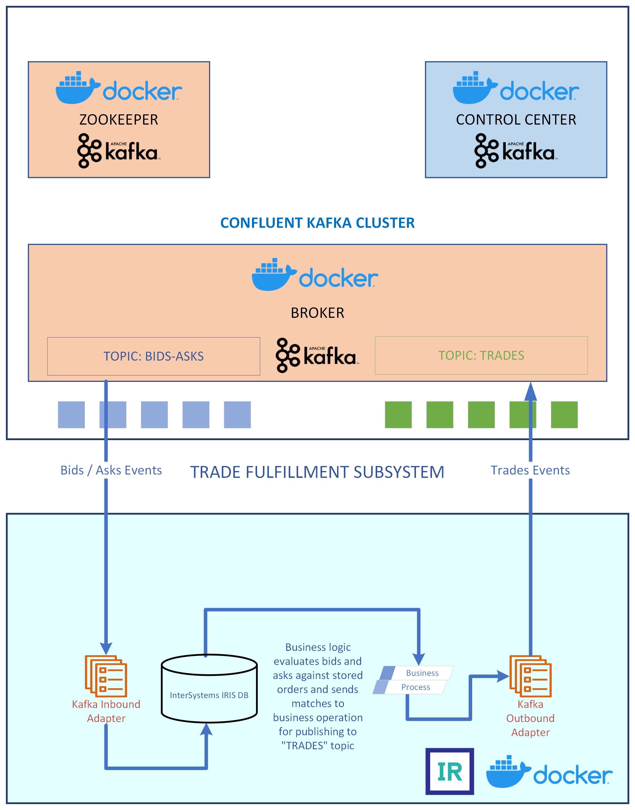

# iris-docker-kafka-docker
Demonstrate integration of InterSystems IRIS and Kafka running in separate containers. If you're looking for a solution which has IRIS and Kafka both running in the same container, plesae [see here](https://github.com/isc-krakshith/iris-kafka-docker) OR for one where IRIS runs natively and connects to Kafka running in container [see here](https://github.com/isc-krakshith/iris-native-kafka-docker)

The Kafka cluster is adapted from the docker-composition sepcified [here](https://developer.confluent.io/quickstart/kafka-docker/). Control center container adds a GUI, albeit with limited use for this solution.

Some knowledge on InterSystems IRIS is desribale but not necessary. No prior knowledge of KAFKA is required.

## Prerequisites
Make sure you have [git](https://git-scm.com/book/en/v2/Getting-Started-Installing-Git) and [Docker desktop](https://www.docker.com/products/docker-desktop) installed.

## Installation 

Clone/git pull the repo into any local directory

```
$ git clone https://github.com/isc-krakshith/iris-docker-kafka-docker.git
```
Open a command line in this directory and run:
```
$ docker-compose build
$ docker-compose up -d
```
### Wait for KAFKA cluster to be ready
Zookeeper, Broker and Control Center will each be running in their own containers. Navigate to [KAFKA Control Center](http://localhost:9021)
You will need for the cluster to become stable before it is ready for use. Reload the page on the browser unitl the cluster is showing as healthy.
## Solution


## How to Use it
#### Start the Production
Navigate to [Kafka.TraderProduction](http://localhost:52773/csp/kafka/EnsPortal.ProductionConfig.zen?PRODUCTION=Kafka.TraderProduction), and click the "Start" button
### Produce and consume events via shell sessions in the Kafka container
#### EXECUTE 2x CONTAINER SHELLS
++++++++++++++++++++++++++
```
docker-compose exec broker bash
```
##### BASH 1 : CREATE AND PRODUCE EVENTS ON A TOPIC
In the first shell... (commands in ./confluentKafka/ProduceBidsAsks.sh)
```
$ /bin/kafka-topics --create --topic bids-Asks --bootstrap-server localhost:9092
$ /bin/kafka-console-producer --topic bids-Asks --bootstrap-server localhost:9092
```
##### BASH 2 : CONSUME EVENTS FROM A TOPIC
In the second shell...(commands in ./confluentKafka/ConsumeTrades.sh)
```
$ /bin/kafka-console-consumer --topic trades --bootstrap-server localhost:9092
```
##### BASH 1 : PRODUCE EVENTS
Go back to the first shell...
Then generate bid-ask events, one line at a time... After each event is produced, the resulting trades topic events are visbile the second shell described above as well as in the Management Portal (Select any of the components of the production by clicking once -> On the right hand pane, select the "Messages" tab, then any of the messages in the list to explore them in depth)
```
{"dateTime":"2022-06-07T13:16:22.000","ref":"OH77BBN3", "security":"SECA", "bid":50, "ask":0, "vol":300}
```
```
{"dateTime":"2022-06-07T13:17:32.000","ref":"OH77CBN3", "security":"SECB", "bid":0, "ask":50, "vol":400}
```
```
{"dateTime":"2022-06-07T13:18:42.000","ref":"OH77DBN3", "security":"SECC", "bid":0, "ask":55, "vol":200}
```
```
{"dateTime":"2022-06-07T13:19:52.000","ref":"OH77EBN3", "security":"SECD", "bid":70, "ask":0, "vol":250}
```
#### Start InterSystem IRIS terminal to test it
```
$ iris session iris
USER> zn "KAFKA"
KAFKA> do ##class(Kafka.TestKafkaMessagingClient).KafkaClient()
```